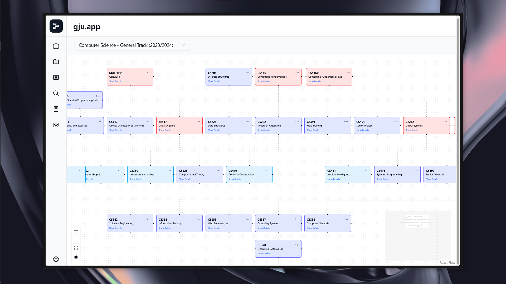

<div align="center">
    <a href="https://gju.app"><h1>gju.app</h1></a>
    
</div>

## Installation

> [!CAUTION]
> Project is Under Development and not ready now


[](https://stackblitz.com/github/GJU-IT-Club/gju)
[](https://codesandbox.io/p/sandbox/github/GJU-IT-Club/gju)


```sh
git clone https://github.com/GJU-IT-Club/gju.git
cd gju  # Navigates Directory to gju/
npm i   # install dependencies (requires node) 
```

---

## 👾 Techstack

- Astro & React
- Tailwind & Shadcn
- Typescript

## 🌿 Branches

Our project uses the following branch structure:

- `main`: Production-ready code. This branch is deployed to the live environment and should remain stable at all times.
- `test`: Testing/staging branch where features are integrated and tested before being merged to `main`.
- `dev/name`: Development branches where individual contributors work on features or fixes. Replace "name" with your name (e.g., `dev/ahmad`, `dev/sarah`).

### Branch Workflow

1. Create a new branch from `test` using the format `dev/your-name`
2. Implement your feature or fix in your development branch
3. Open a pull request to merge your changes into the `test` branch
4. After testing and review in the `test` environment, changes are merged into `main`

## 🚀 Project Structure

Inside of your Astro project, you'll see the following folders and files:

```text
/

├── public/             # Static assets (fonts, images, etc.)
└───src
    ├───assets/         # Assets that'll be used inside in the App (SVGs, Images)
    ├───components/     # UI components
    │   ├───common      # Shared components
    │   ├───features    # Feature-specific components
    │   ├───seo         # SEO-specific components
    │   └───ui          # Shadcn installed components (no need to edit)
    ├───content         # Static Content goes here (course data, professors, blogs)
    ├───data            # Data (siteData, etc.)
    ├───hooks           # React hooks
    ├───layouts         # Page layouts
    ├───lib             # code logic goes here
    ├───stores          # State Management
    ├───styles
    └───utils           # Helper functions
│   └── pages/
│       └── index.astro     # index page at https://gju.app/
├── astro.config.mjs        # Astro configuration
├── tsconfig.json           # TypeScript configuration
├── package.json            # Dependencies and scripts
└── README.md               # The file you're reading now
```

Astro looks for `.astro` or `.md` files in the `src/pages/` directory. Each page is exposed as a route based on its file name.

There's nothing special about `src/components/`, but that's where we like to put any Astro/React/Vue/Svelte/Preact components.

Any static assets, like images, can be placed in the `public/` directory.

## 🧞 Commands

All commands are run from the root of the project, from a terminal:

| Command                   | Action                                           |
| :------------------------ | :----------------------------------------------- |
| `npm install`             | Installs dependencies                            |
| `npm run dev`             | Starts local dev server at `localhost:4321`      |
| `npm run build`           | Build your production site to `./dist/`          |
| `npm run preview`         | Preview your build locally, before deploying     |
| `npm run astro ...`       | Run CLI commands like `astro add`, `astro check` |
| `npm run astro -- --help` | Get help using the Astro CLI                     |

## 👀 Want to learn more?

Feel free to check [Astro documentation](https://docs.astro.build) or jump into our [Discord server](https://discord.gg/cFCzxjD3gJ).
